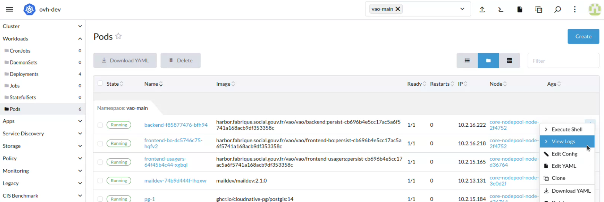

# VAO : Vacances Adaptées Organisées

Ce SI a pour vocation à dématérialiser l'ensemble des procédures liées à l'organisation de séjours pour les personnes handicapées.

Il se compose d'un portail réservé aux organismes (ceux qui souhaitent organiser un séjour adapté) et d'un back office réservé à l'administration (DR, DD, AC) permettant l'instruction des demandes faites par les organismes.

Les démarches proposées aux organismes sont :

- la demande d'agrément
- la déclaration de séjour

Côté Back Office, il y a 4 modules :

- instruction des demandes d'agrément,
- instruction des demandes de séjour,
- contrôle : inspection des séjours organisées,
- statistiques

L'application fait appel aux apis extérieures suivante :

- [api-adresse](https://api-adresse.data.gouv.fr)
- [api-entreprise](https://entreprise.api.gouv.fr/v3)
- [api-insee](https://api.insee.fr)
- [openstreetmap](https://www.openstreetmap.fr/)

Elle se connecte également à un serveur SMTP pour l'envoi de mail.

# Technologies

Pour le frontend :

- NuxtJs
- VueJs
- Pinia
- Vee-validate
- yup

Utilisation de vue-dsfr dans les templates.

Pour le backend :

- NodeJs
- express
- yup
- pg

Pour la persistance des données, le SGBD Postgres est utilisé.

# Développement

## Local

### Prérequis

Le développement s'appuie sur [docker](https://docs.docker.com/engine/install/). La version 26 est utilisé au début du projet.

Afin d'installer la stack, le plugin [docker compose](https://docs.docker.com/compose/install/) est utilisé.

 Le gestionnaire de paquets utilisé est [pnpm](https://pnpm.io/).

### Avant le premier lancement

La stack s'appuie sur le fichier [docker-compose.yaml](./docker-compose.yaml) à la base du projet.

Les différents services s'appuient sur des variables d'environnements.
Celles-ci sont renseignées par défaut dans le fichier .env et peuvent être surchargées dans le fichier [docker-compose.yaml](./docker-compose.yaml).

> Le fichier .env contenant des variables sensibles, un fichier contenant toutes les variables nécessaires au fonctionement en local a été construit, laissant uniquement les secrets sans valeurs. Ces dernièrs doivent être renseignés manuellement.

Pour initialiser le fichier .env, copier le fichier d'exemple [.env.dev.example.env](./.env.dev.example.env) et combler les valeurs manquantes.

`cp .env.dev.example.env .env`

### Lancement

Lancer la stack via docker compose :

`docker compose up -d`

Attention : le premier lancement est long et peut prendre jusqu'à plusieurs minutes. Il faut regarder les logs via `docker compose logs -f` et attendre que les builds nuxt aient bien fini.

Quand MinIO (S3 en local) a démarré, aller sur la console web `http://localhost:9001` et se connecter avec le compte user `minioadmin` et le mot de passe `minioadmin` (comme ce qui est indiqué dans le fichier `.env`).
Créer ensuite un bucket appelé `vao` (qui correspond à `S3_BUCKET_NAME` dans le fichier `.env`). Par la suite, il est possible d'utiliser cette console pour vérifier et débugger toute la partie stockage de fichiers en local.

### Logs

Afin de suivre toutes les logs de la stack simultanément :

`docker compose logs -f`

Pour suivre les logs d'un seul container :

`docker compose logs -f <service> --no-log-prefix`

### Base de données

#### Initialisation

Le script [lancement.sh](./pg/lancement.sh) est lancé lors de la création du container postgres.

Ce dernier lance les scripts de création de schémas, de rôles et de tables ainsi que l'insertion des données de référentiel, tous issus du répertoire [scripts](./pg/scripts/).

Des données de tests sont également renseignées dans le dossier [seeds](./pg/seeds/). Ces derniers ne sont lancés que localement, contrairement aux environnements kubernetes.

La base de données n'est persistée que le temps de la durée de vie du container. Autrement dit, supprimer le container revient à supprimer les données.

#### Persistence des données

La persistence de la base de données ne dure qu'autant que la durée de vie du container. Il est donc possible de stopper le container postgres et de le redémarrer en conservant les données, cependant supprimer le container supprimera les données. A la recréation, le script [lancement.sh](./pg/lancement.sh) sera relancé.

Afin de conserver les données dans le cas d'une mise à jour du schéma de la base de données, il sera donc nécessaire de faire évoluer manuellement celui-ci. Pour cela, il est possible de se connecter directement au container :

`docker compose exec -ti postgres psql -U <PG_VAO_USER>`

### Tests end-to-end

Installer les paquets (sans passer par docker) :

`pnpm -w install`

Installer les navigateurs (headless) utilisés par Playwright :

`pnpm exec playwright install`

Lancer les tests (attention il faut avoir démarré la stack locale via docker, cf plus haut) :

`pnpm -w tests:e2e`

Pour débugger ou écrire de nouveaux tests, utiliser l'interface graphique de Playwright :

`pnpm -w tests:e2e:ui`

## Kubernetes

## CI/CD

Chaque PR créée sur github déclenche le déploiement d'un nouvel environnement de test temporaire (une semaine par défaut).
Une fois la PR fusionné sur main, l'environnement persistant main est mis à jour.
Un environnement de recette persistant est déployé et peut être mis à jour _manuellement_ via une github action.
Enfin, un dernier environnement persistant de production a été créé.

Chaque environnement est déployé sur une instance Kubernetes et est isolé des autres. Autrement dit, ils ne partagent aucune information et sont accessibles séparément via des URLs différentes.

Pour plus d'informations, se rendre sur [le site de documentation générale de la fabrique](https://socialgouv.github.io/support/docs/standards/developpement#urls-des-environnements).

Les workflows permettant de créer les Actions dans github sont décrit dans la section [workflows](./.github/workflows/).

La stack déployée sur Kubernetes est décrite dans la section [kontinuous](./.kontinuous).

## Rancher

Rancher est une application permettant d'interagir avec les namespaces hébergés sur Kubernetes.

Chaque utilisateur peut se rendre sur le Rancher de la fabrique via [ce lien](https://rancher.fabrique.social.gouv.fr/).

Une fois authentifié, et après avoir choisi son cluster (ovh-dev pour tous les environnements, hormis celui de production, ovh-prod pour ce dernier), vous pourrez accéder aux différentes ressources déployées.

Il est recommandé de filtrer sur le namespace souhaité avant de continuer dans la barre de sélection eu haut à droite de la page.

### Logs

Afin de suivre les logs d'un container, se rendre dans la sections Workloads > Pods puis cliquer sur le boutton 'View Logs'

Le niveau de logs du backend est décrit par la variable d'environnement DEBUG.

### Accès au container

Afin de suivre les logs d'un container, se rendre dans la sections Workloads > Pods puis cliquer sur le boutton 'Execute Shell'

> Par ailleurs, il est également possible de se connecter depuis votre terminal ou votre IDE en suivant la démarche renseignée [ici](https://socialgouv.github.io/support/docs/faq#bases-de-donn%C3%A9es-postgresql-cnpg) (fonctionne pour tous les containers, il suffit de choisir le bon nom de container lors de la commande exec).

### Variables d'environnement

Concernant les variables d'environnement des frontend, celles-ci sont renseignées à l'étape de build, à savoir dans la section jobs > runs > build-<service> > with > buildArgs.

Concernant les variables d'environnement du backend, celles-ci sont renseignées au lancement de l'image, à savoir dans la section backend > envFrom > ...

Les variables d'environnement du backend se divisent en deux types :

- les variables publiques stockées dans les configmap ([exemple](./.kontinuous/env/prod/templates/backend.configmap.yaml))
- les variables privées stockées dans les secrets ([exemple](./.kontinuous/env/prod/templates/api-entreprise.sealed.secret.yaml)). Cellesci sont encodées en amont via l'outil [WebSeal](https://socialgouv.github.io/sre-tools/?cluster=dev)

Plus d'informations [ici](https://socialgouv.github.io/support/docs/standards/kubernetes#variable-denvironnement-dans-kubernetes).

Hormis dans le cas d'un test à la volée, les changements de variables nécessitent de passer par une PR.
Pas pas à dans [pas à pas WebSeal](./docs/sealed-secret) :lock:

## [Backup](./docs/backup)

Les backup de postgres sont gérés par la Fabrique via Kubernetes.
Mais il est possible de lancer un backup à la volée depuis le Rancher.
Il est recommandé de le faire avant chaque déploiement en production.

:point_right: [Backup](./docs/backup)

## :rocket: [Déploiement](./docs/deploiement)

Déploiement pas à pas d'un hotfix ou d'une release en production.

:point_right: [Déploiement](./docs/deploiement)
