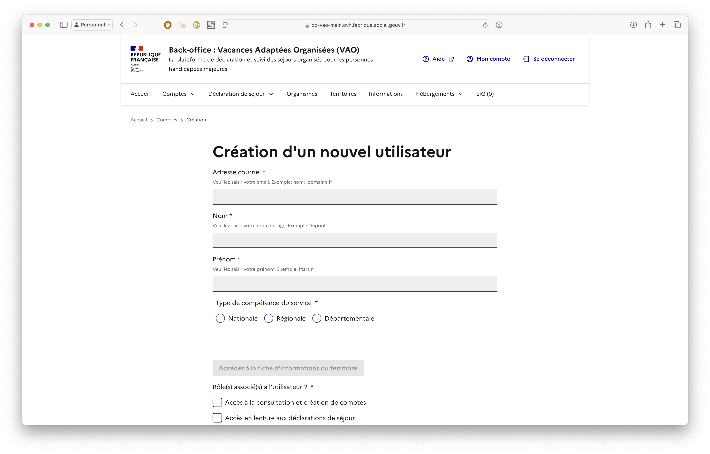
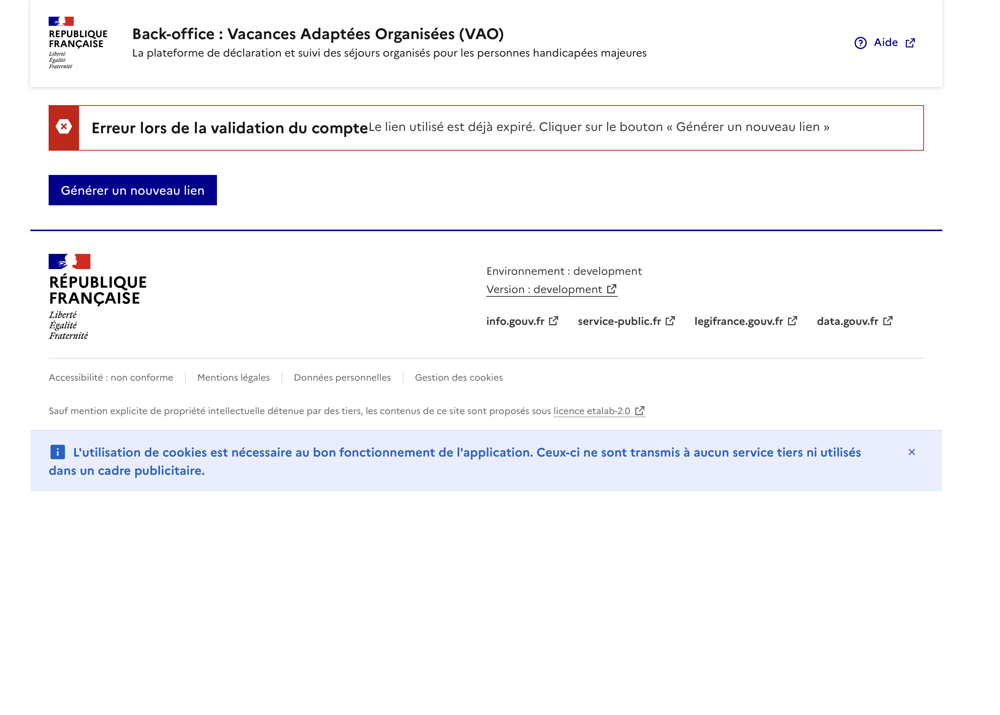
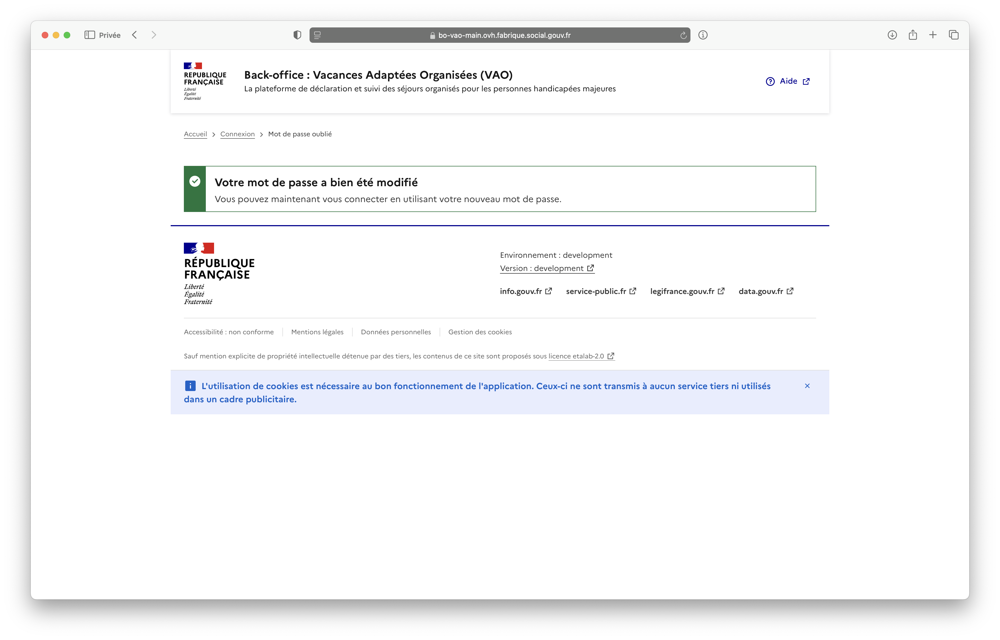

# Création de compte agent

## Création agent régional

<figure><figcaption>
Page de création d'un nouvel utilisateur
</figcaption></figure>



### Formulaire de création de compte

La page de création de compte pour un agent régional est composé d'un formulaire.&#x20;

Détail du formulaire

<table><thead><tr><th width="175">Nom du champ</th><th width="153">Type</th><th width="119">Obligatoire</th><th>Précision</th></tr></thead><tbody><tr><td>Adresse courriel</td><td>Email </td><td>O</td><td></td></tr><tr><td>Nom</td><td>Texte</td><td>O</td><td></td></tr><tr><td>Prénom</td><td>Texte</td><td>O</td><td></td></tr><tr><td>Type de compétence du service</td><td>Buttons radio</td><td>O</td><td>1 choix possible :  - National - Région - Départemental</td></tr><tr><td>Région du service</td><td>Liste de choix</td><td>O</td><td>Si région ou dépargemental choisi dans le champ précédent, une liste de choix apparait pour sélection de la région ou du département. </td></tr><tr><td>Accéder à la fiche du territoire</td><td>Bouton</td><td>N</td><td>Pointe vers la page du territoire sélectionnée dans la liste de choixRôle(s) associé(s) à l'utilisateur ?</td></tr><tr><td>Rôle(s) associé(s) à l'utilisateur ?</td><td>Cases à cocher</td><td>O</td><td>
Plusieurs choix possibles cumultaif : 
<ul><li>Accès à la consultation et création de comptes</li><li>Accès en lecture aux déclarations de séjour</li><li>Accès en lecture/écriture aux déclarations de séjour</li><li>Autorisé à désactiver les comptes du BO</li></ul></td></tr></tbody></table>




### Réception du mail de confirmation



À la reception du mail de conformation, l'utilisateur est dirigé vers la page d'initialisition de mot de passe lors du clic sur le bouton d'activation de compte.&#x20;

Le lien est valide durant 1 heure.&#x20;

Dans le cas où le lien d'activation n'est plus valide, l'utilisateur est dirigé vers la page de génération d'un nouveau lien d'activation de création de compte.&#x20;

Capture

<figure><figcaption></figcaption></figure>




### Formulaire d'initialisation de mot de passe

L'utilisateur renseigne un mot de passe pour finaliser la création de compte. \
L'email n'est pas éditable.&#x20;

Capture

<figure><figcaption>
Page d'initialisation / changement de mot de passe
</figcaption></figure>




### Confirmation de création de mot de passe

L'utilisateur arrive sur une page de confirmation

Capture

<figure><figcaption></figcaption></figure>




### Connexion au SI-VAO

Une fois les étapes précédentes réalisées, l'utilisateur peut se connecter via la page de connexion&#x20;

Capture

<figure><figcaption></figcaption></figure>




|                                                                              | **National (DGCS)**                                                                       | **Régional (DRETS)**                                                                | **Départemental (DDETS)**                                              | **Commentaire**                                                                                                                                                                                                                  |
| ---------------------------------------------------------------------------- | ----------------------------------------------------------------------------------------- | ----------------------------------------------------------------------------------- | ---------------------------------------------------------------------- | -------------------------------------------------------------------------------------------------------------------------------------------------------------------------------------------------------------------------------- |
| **Je peux créer des comptes utilisateurs pour**                              | <ul><li>National</li><li>Toutes les Régions</li><li>Tous les départements</li></ul>       | <ul><li>Pour les département rattachés à ma région</li><li>Pour ma région</li></ul> | <ul><li>Mon propre département (use case : nouveau collègue)</li></ul> |                                                                                                                                                                                                                                  |
| **Je peux visualiser les comptes utilisateur**                               | <ul><li>National</li><li>de toutes les Régions</li><li>de tous les départements</li></ul> | <ul><li>des département rattachés à ma région</li><li>de ma région</li></ul>        | <ul><li>de mon propre département</li></ul>                            |                                                                                                                                                                                                                                  |
| **Je peux éditer les comptes utilisateur**                                   | <ul><li>National</li><li>de toutes les Régions</li><li>de tous les départements</li></ul> | <ul><li>des département rattachés à ma région</li><li>de ma région</li></ul>        | <ul><li>de mon propre département</li></ul>                            |                                                                                                                                                                                                                                  |
| **Je peux supprimer les comptes utilisateurs (ou rendre inactif le compte)** | <ul><li>National</li><li>de toutes les Régions</li><li>de tous les départements</li></ul> | <ul><li>des département rattachés à ma région</li><li>de ma région</li></ul>        | <ul><li>de mon propre département</li></ul>                            | 
Si suppression, est-ce qu’on garde l’historique de l’utilisateur qui a instruit des dossier ? (Soft delete). <strong>Pas de suppression de compte.</strong>

<strong>Rendre inactif et garder l’historique.</strong>
 |

