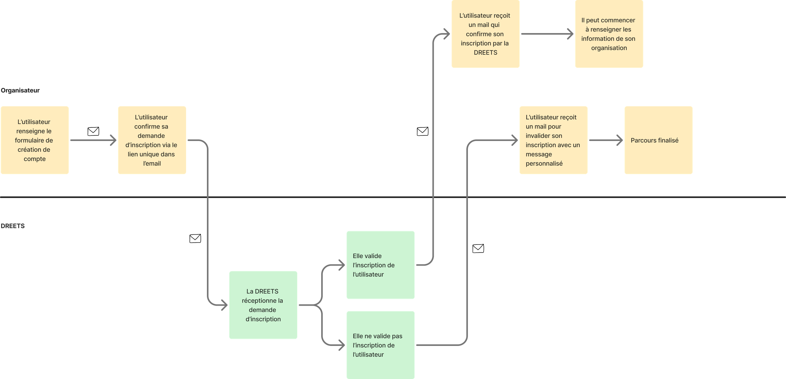

# Création de compte


**Important**\
La création de compte nécessite **une étape de validation obligatoire** avant de pouvoir accéder à la plateforme.

\
Cette validation peut être effectuée selon **2 scénarios spécifiques** :

1. L’organisme n’a pas encore de compte utilisateur sur la plateforme VAO (aucun SIRET rattaché) : c’est **la région** à laquelle est rattaché l’organisme qui validera la demande de création de compte
2. L’organisme a déjà un compte utilisateur sur la plateforme VAO (SIRET déjà renseigné sur la plateforme) : c’est **un utilisateur déjà inscrit** dont le compte est lié à l’organisme qui validera la demande de création de compte


## Scénario 1 - L’organisme n’existe pas sur la plateforme VAO

<figure><figcaption></figcaption></figure>



### L’utilisateur OVA renseigne le formulaire de création de compte

Capture

<figure><figcaption>
Page de création de compte pour les OVA
</figcaption></figure>

Un email est envoyé à l’OVA pour confirmer sa demande



L’utilisateur OVA valide sa demande d’inscription via le bouton disponible dans le mail. Validité du lien 1h.

Capture

<figure><figcaption></figcaption></figure>




### La DREETS valide le compte

Suite à la confirmation de la demande de création de compte, la DREETS de la région où est situé l’OVA reçoit une notification pour alerter qu’un nouvel utilisateur OVA souhaite créer un compte sur le SI-VAO







Capture

