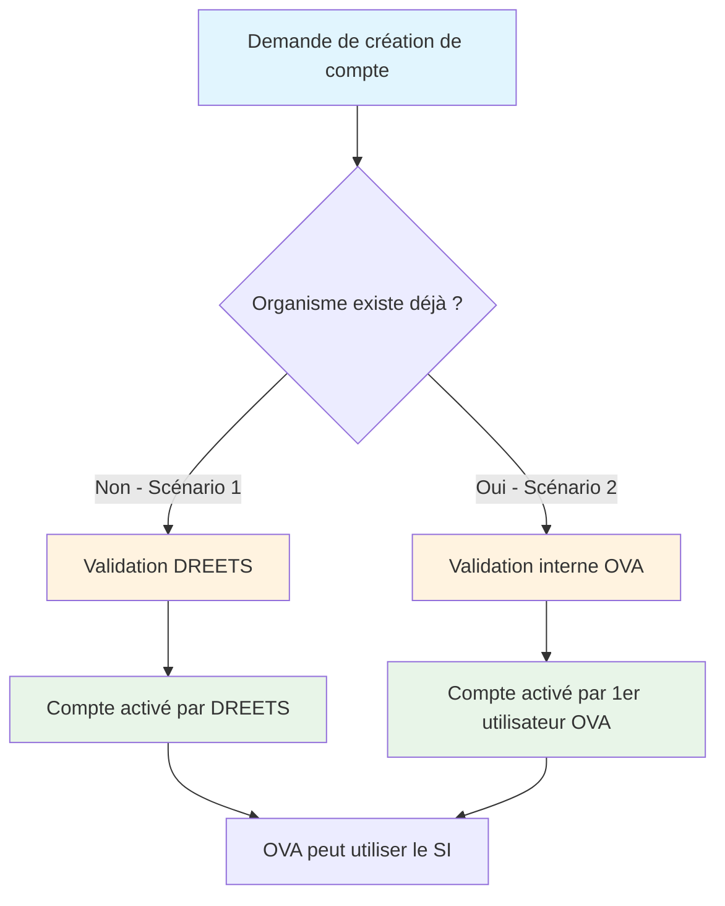

# Création de compte


**Important**\
La création de compte nécessite **une étape de validation obligatoire** avant de pouvoir accéder à la plateforme.

\
Cette validation peut être effectuée selon **2 scénarios spécifiques** :

1. L’organisme n’a pas encore de compte utilisateur sur la plateforme VAO (aucun SIRET rattaché) : c’est **la région** à laquelle est rattaché l’organisme qui validera la demande de création de compte
2. L’organisme a déjà un compte utilisateur sur la plateforme VAO (SIRET déjà renseigné sur la plateforme) : c’est **un utilisateur déjà inscrit** dont le compte est lié à l’organisme qui validera la demande de création de compte


<table data-view="cards"><thead><tr><th></th><th data-hidden data-card-cover data-type="files"></th><th data-hidden data-card-target data-type="content-ref"></th></tr></thead><tbody><tr><td><strong>Scénario 1 - L'organisme n'existe pas sur la plateforme VAO</strong></td><td><a href="../../.gitbook/assets/wesley-tingey-ZdOW9Qd8mQo-unsplash.jpg">wesley-tingey-ZdOW9Qd8mQo-unsplash.jpg</a></td><td><a href="scenario-1-lorganisme-nexiste-pas-sur-la-plateforme-vao.md">scenario-1-lorganisme-nexiste-pas-sur-la-plateforme-vao.md</a></td></tr><tr><td><strong>Scénario 2 – L'organisme a déjà un ou plusieurs comptes utilisateurs sur la plateforme VAO</strong></td><td><a href="../../.gitbook/assets/sumner-mahaffey-7Y0NshQLohk-unsplash.jpg">sumner-mahaffey-7Y0NshQLohk-unsplash.jpg</a></td><td><a href="scenario-2-lorganisme-a-deja-un-ou-plusieurs-comptes-utilisateurs-sur-la-plateforme-vao.md">scenario-2-lorganisme-a-deja-un-ou-plusieurs-comptes-utilisateurs-sur-la-plateforme-vao.md</a></td></tr></tbody></table>

## Désactivation de compte OVA

Depuis la version v1.22.0, les agents du Back Office peuvent désactiver les comptes des utilisateurs OVA (Organisateurs de Vacances et d'Accueil) :

### Fonctionnalité de désactivation
- **Qui peut désactiver** : Les agents du Back Office avec les permissions appropriées
- **Comptes concernés** : Tous les comptes utilisateurs OVA (personnes morales et physiques)
- **Effet** : Le compte désactivé ne peut plus se connecter à la plateforme

### Processus de désactivation
1. L'agent accède à la liste des comptes utilisateurs OVA
2. Il sélectionne le compte à désactiver
3. Il clique sur l'action "Désactiver le compte"
4. Une confirmation est demandée avant la désactivation
5. Le compte est immédiatement désactivé

### Conséquences de la désactivation
- **Connexion** : L'utilisateur ne peut plus se connecter à la plateforme
- **Données** : Les données existantes sont conservées
- **Réactivation** : Seul un agent du Back Office peut réactiver le compte
- **Notifications** : L'utilisateur reçoit un email de notification de désactivation

### Gestion des permissions
- Seuls les agents avec le rôle "Autorisé à désactiver les comptes du BO" peuvent effectuer cette action
- La désactivation est tracée dans les logs du système
- Les agents peuvent voir l'historique des désactivations/réactivations
