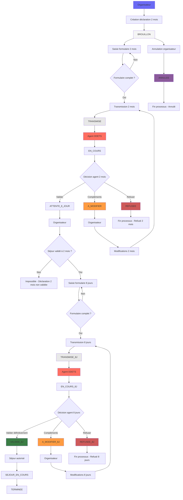
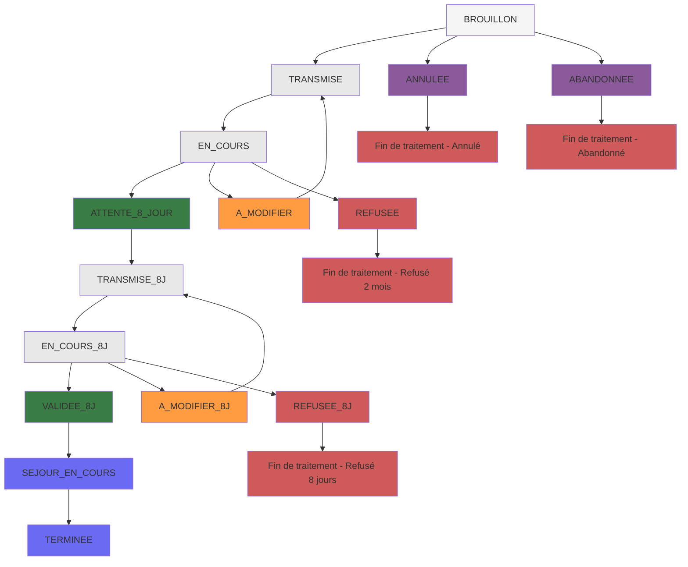

# Déclaration de séjour

## Vue d'ensemble

Le processus de déclaration de séjour se déroule en **deux étapes distinctes** selon la réglementation :&#x20;

<table data-view="cards"><thead><tr><th></th><th data-hidden data-card-cover data-type="files"></th><th data-hidden data-card-target data-type="content-ref"></th></tr></thead><tbody><tr><td><strong>Déclaration à 2 mois</strong></td><td><a href="../../.gitbook/assets/photo-1749371930388-50c782b0acea.jpeg">photo-1749371930388-50c782b0acea.jpeg</a></td><td><a href="declaration-a-2-mois/">declaration-a-2-mois</a></td></tr><tr><td><strong>Déclaration à 8 jours</strong></td><td><a href="../../.gitbook/assets/photo-1748164685130-db6d3752d9e2.jpeg">photo-1748164685130-db6d3752d9e2.jpeg</a></td><td><a href="declaration-a-8-jours/">declaration-a-8-jours</a></td></tr></tbody></table>

***

## Processus et statuts

### **Workflow général**

### **Les statuts du processus**

#### **Les statuts du processus**

| Statut                   | Signification                        | Actions possibles                      | Rôles autorisés       |
| ------------------------ | ------------------------------------ | -------------------------------------- | --------------------- |
| `BROUILLON`              | Déclaration en cours de saisie       | Saisie, transmission                   | Organisateur          |
| `TRANSMISE`              | Déclaration à 2 mois transmise       | Instruction par les agents             | Agent DDETS           |
| `EN_COURS`               | En instruction à 2 mois              | Validation, demande compléments, refus | Agent DDETS           |
| `A_MODIFIER`             | Compléments demandés à 2 mois        | Modification par l'organisateur        | Organisateur          |
| `ATTENTE_8_JOUR`         | Validée à 2 mois, en attente 8 jours | Saisie déclaration à 8 jours           | Organisateur          |
| `TRANSMISE_8J`           | Déclaration à 8 jours transmise      | Instruction par les agents             | Agent DDETS           |
| `EN_COURS_8J`            | En instruction à 8 jours             | Validation, demande compléments, refus | Agent DDETS           |
| `A_MODIFIER_8J`          | Compléments demandés à 8 jours       | Modification par l'organisateur        | Organisateur          |
| `VALIDEE_8J`             | Validée définitivement               | Séjour autorisé                        | Système (automatique) |
| `SEJOUR_EN_COURS`        | Séjour en cours                      | Suivi                                  | Système (automatique) |
| `TERMINEE`               | Séjour terminé                       | Archive                                | Système (automatique) |
| `REFUSEE` / `REFUSEE_8J` | Refusée                              | Fin de processus                       | Agent DDETS           |
| `ANNULEE`                | Annulée par l'organisateur           | Fin de processus                       | Organisateur          |
| `ABANDONNEE`             | Abandonnée                           | Fin de processus                       | Organisateur          |

### **Règles métier importantes**

* **Obligation** : Toute déclaration à 2 mois doit être validée pour permettre la déclaration à 8 jours
* **Délais** : Respect strict des délais (2 mois et 8 jours avant le séjour)
* **Modifications** : Possibilité de modifier les informations jusqu'à la transmission
* **Notifications** : Emails automatiques à chaque étape du processus
* **Documents** : Génération automatique de PDF (déclarations et accusés de réception)
* **Logs** : chaque étape et chaque message sont enregistrés dans [l'historique de la déclaration](page-detaillee-declaration.md#id-3.-historique-de-la-declaration)
