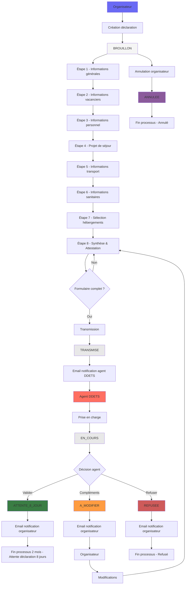

---
layout:
  width: default
  title:
    visible: true
  description:
    visible: true
  tableOfContents:
    visible: true
  outline:
    visible: true
  pagination:
    visible: false
---

# Déclaration à 2 mois

La déclaration à 2 mois est la première étape obligatoire du processus de déclaration de séjour. Elle permet de déclarer l'intention d'organiser un séjour au moins 2 mois avant le début du séjour.

## Objectif

Déclarer l'intention d'organiser un séjour au moins 2 mois avant le début du séjour.

## Étapes du formulaire

* [Étape 1 - Informations générales](etape-1-informations-generales.md)
* [Étape 2 - Informations sur les vacanciers](etape-2-informations-sur-les-vacanciers.md)
* [Étape 3 - Informations sur le personnel](etape-3-informations-sur-le-personnel.md)
* [Étape 4 - Projet de séjour](etape-4-projet-de-sejour.md)
* [Étape 5 - Informations sur le transport](etape-5-informations-sur-le-transport.md)
* [Étape 6 - Informations sanitaires](etape-6-informations-sanitaires.md)
* [Étape 7 - Sélection des hébergements](etape-7-selection-des-hebergements.md)
* [Étape 8 - Synthèse](etape-8-synthese.md)

## Workflow

