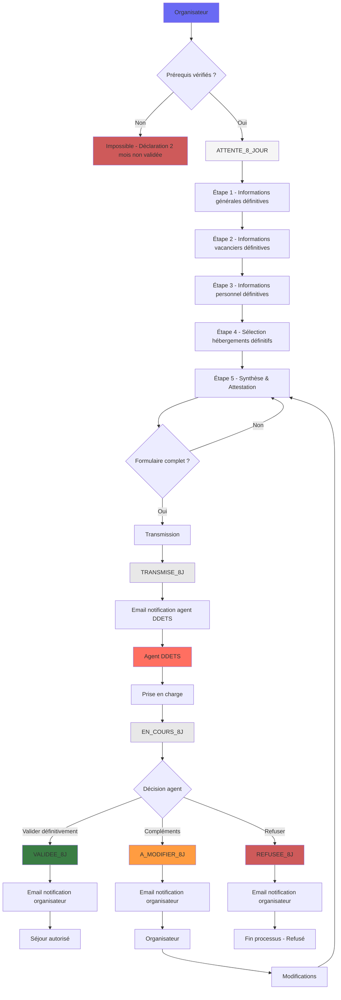

---
layout:
  width: default
  title:
    visible: true
  description:
    visible: true
  tableOfContents:
    visible: true
  outline:
    visible: true
  pagination:
    visible: false
---

# Déclaration à 8 jours

La déclaration à 8 jours est la deuxième étape du processus de déclaration de séjour. Elle ne peut être effectuée que si la déclaration à 2 mois a été validée par les agents DDETS.

## Objectif

Confirmer les informations définitives du séjour 8 jours avant le début.

## Étapes du formulaire

* [Étape 1 - Informations générales](etape-1-informations-generales.md)
* [Étape 2 - Informations sur les vacanciers](etape-2-informations-sur-les-vacanciers.md)
* [Étape 3 - Informations sur le personnel](etape-3-informations-sur-le-personnel.md)
* [Étape 4 - Sélection des hébergements](etape-4-selection-des-hebergements.md)
* [Étape 5 - Synthèse](etape-5-synthese.md)

## Workflow

## Différences avec la déclaration à 2 mois

* **Informations pré-remplies** : Les données de la déclaration à 2 mois sont pré-remplies
* **Effectifs définitifs** : Les effectifs doivent être confirmés ou mis à jour avec les données définitives
* **Détails obligatoires** : Les détails des accompagnants et encadrants deviennent obligatoires
* **Formation obligatoire** : La description de la formation en amont devient obligatoire
