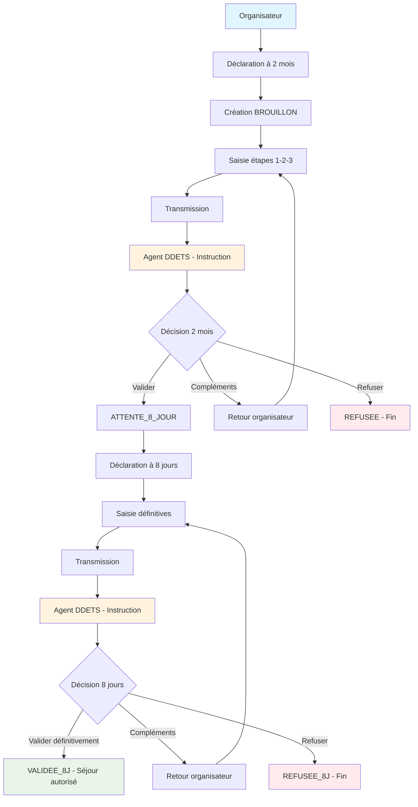
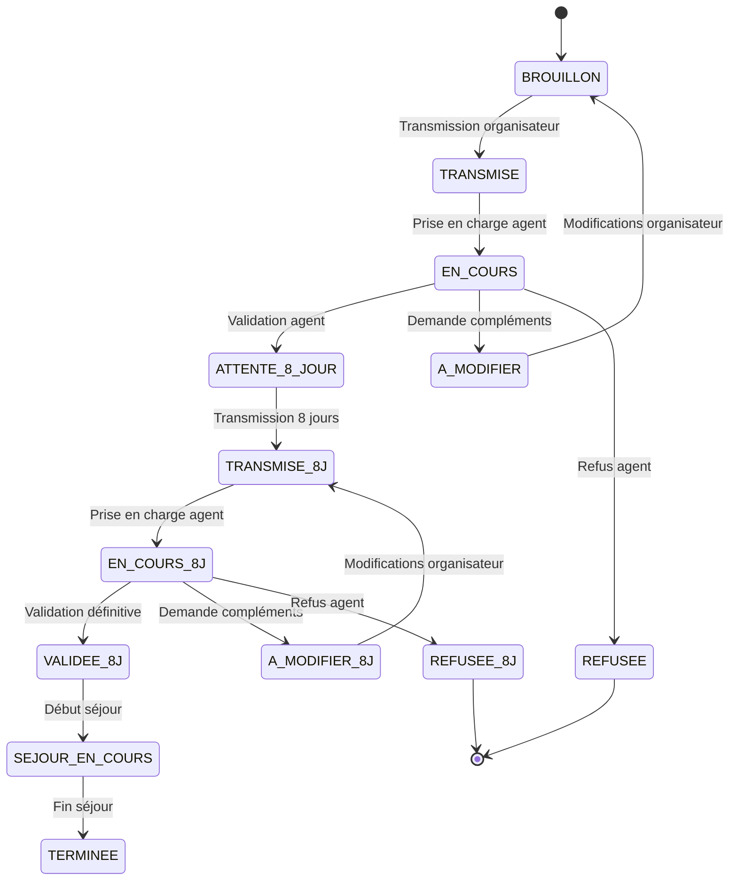

# Workflow des déclarations

Cette page présente les diagrammes de workflow pour les déclarations de séjour à 2 mois et à 8 jours.

***

## Workflow complet - Vue d'ensemble

### **Points clés du workflow complet :**

* **Séquence obligatoire** : 2 mois → 8 jours
* **Validation conditionnelle** : 8 jours possible seulement si 2 mois validé
* **Boucles de correction** : Possibilité de modifications à chaque étape
* **Décisions finales** : Validation définitive ou refus à 8 jours

***

## Statuts et transitions

### **Légende des statuts :**

* **Bleu** : Statuts de saisie par l'organisateur
* **Orange** : Statuts d'instruction par les agents
* **Vert** : Statuts de validation
* **Rouge** : Statuts de refus
* **Jaune** : Statuts de modification demandée
