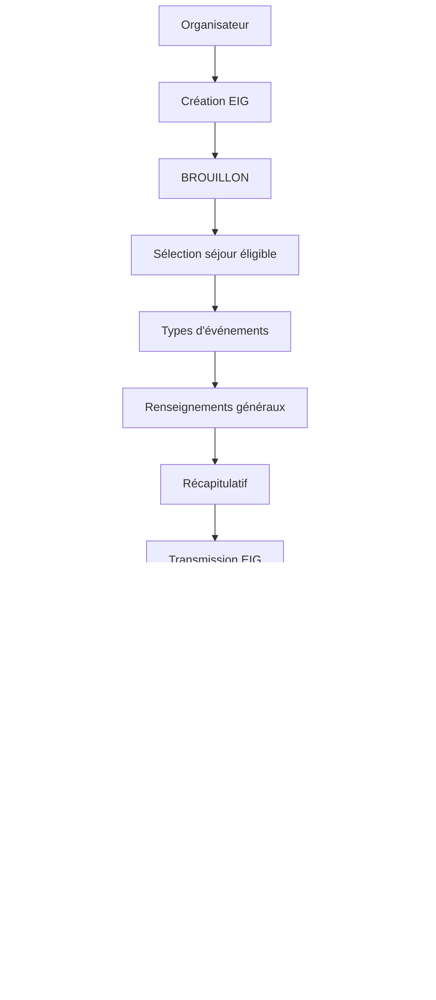
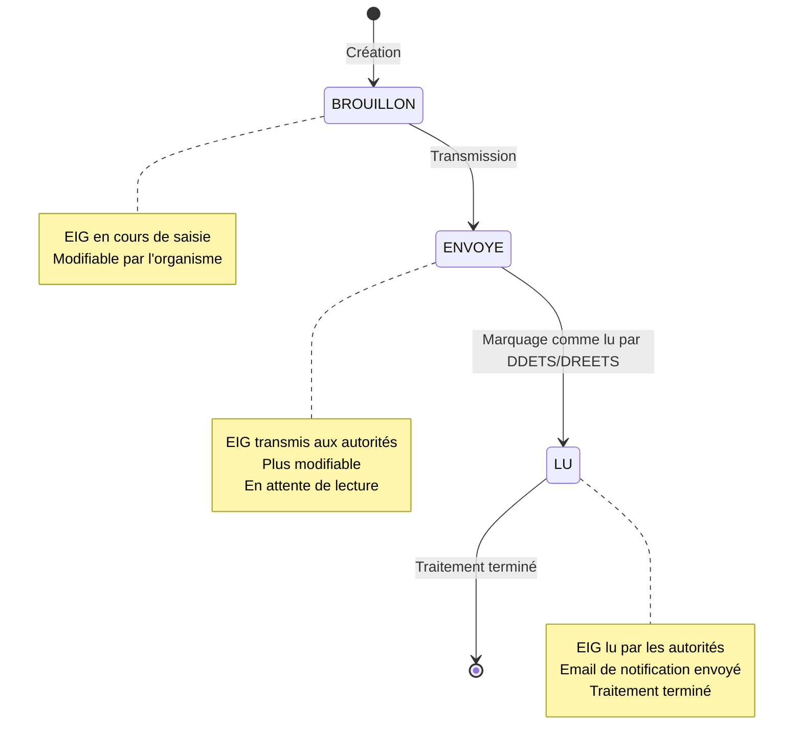

# EIG

Les **Événements Indésirables Graves (EIG)** sont des incidents survenant lors de séjours de vacances adaptées organisées qui présentent des risques graves pour la santé, l'intégrité ou le bien-être physique et moral des personnes handicapées majeures.


**📋 Cadre réglementaire**

L'article R. 412-14-1 du code du tourisme prévoit que les personnes responsables de l'organisation du séjour sur le lieu de vacances sont tenues d'informer sans délai :

* **Le préfet du département** du lieu de séjour
* **Le préfet de région** qui a délivré l'agrément

de tout accident grave ainsi que de toute situation présentant ou ayant présenté des risques graves pour la santé, l'intégrité ou le bien-être physique et moral des personnes handicapées majeures.


## Workflow des EIG

## Statuts des EIG

