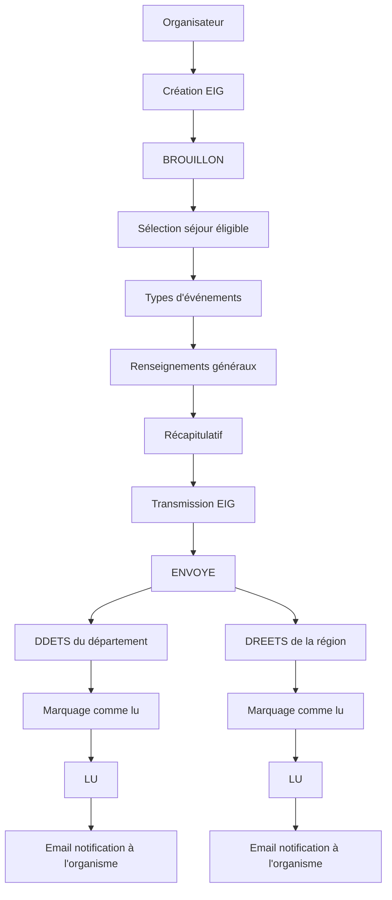
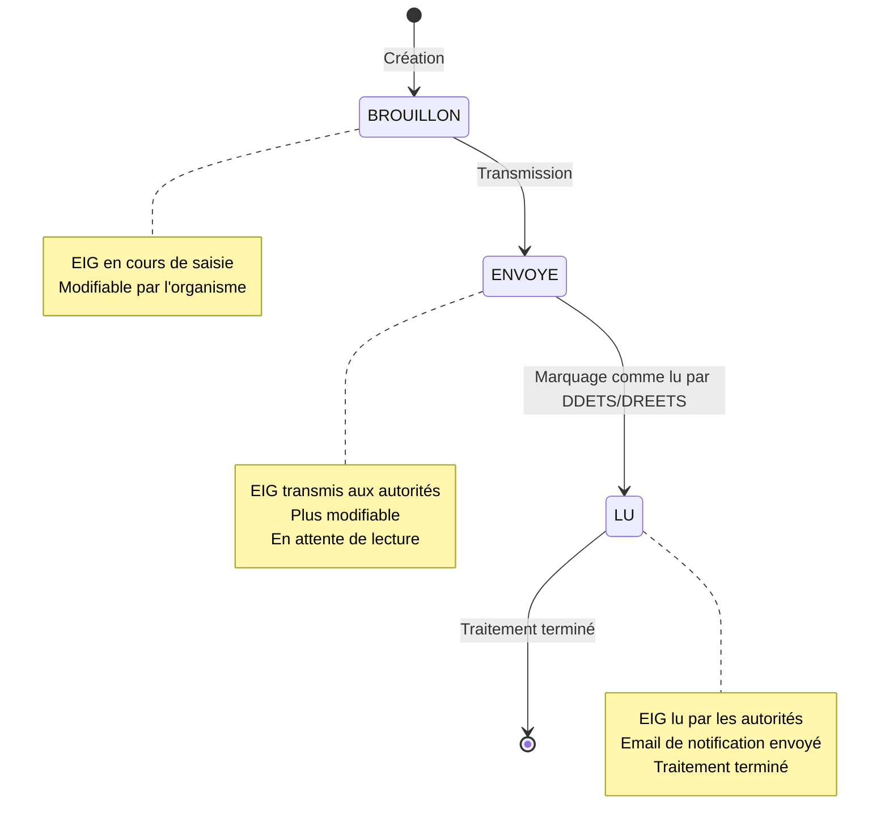

# Événements Indésirables Graves (EIG)

## Vue d'ensemble

Les **Événements Indésirables Graves (EIG)** sont des incidents survenant lors de séjours de vacances adaptées organisées qui présentent des risques graves pour la santé, l'intégrité ou le bien-être physique et moral des personnes handicapées majeures.

### 📋 Cadre réglementaire

L'article R. 412-14-1 du code du tourisme prévoit que les personnes responsables de l'organisation du séjour sur le lieu de vacances sont tenues d'informer sans délai :

- **Le préfet du département** du lieu de séjour
- **Le préfet de région** qui a délivré l'agrément

de tout accident grave ainsi que de toute situation présentant ou ayant présenté des risques graves pour la santé, l'intégrité ou le bien-être physique et moral des personnes handicapées majeures.

### 🔄 Workflow des EIG

### 📊 Statuts des EIG

### 🎯 Types d'événements

Les EIG sont classés en **4 catégories principales** :

<table data-view="cards"><thead><tr><th></th><th data-hidden data-card-cover data-type="files"></th><th data-hidden data-card-target data-type="content-ref"></tr></thead><tbody><tr><td><strong>Victimes</strong></td><td><a href=".gitbook/assets/eig-victimes.png">eig-victimes.png</a></td><td><a href="#victimes">Victimes</a></td></tr><tr><td><strong>Santé</strong></td><td><a href=".gitbook/assets/eig-sante.png">eig-sante.png</a></td><td><a href="#sante">Santé</a></td></tr><tr><td><strong>Sécurité</strong></td><td><a href=".gitbook/assets/eig-securite.png">eig-securite.png</a></td><td><a href="#securite">Sécurité</a></td></tr><tr><td><strong>Fonctionnement organisme</strong></td><td><a href=".gitbook/assets/eig-fonctionnement.png">eig-fonctionnement.png</a></td><td><a href="#fonctionnement-organisme">Fonctionnement organisme</a></td></tr></tbody></table>

#### **Victimes**
- Violences sexuelles
- Viols
- Violences psychologiques et morales
- Violences physiques
- Non respect de la prescription médicale
- Privation de droit
- Négligence grave ou erreurs successives
- Maltraitances non précisées
- Suicide (suspecté ou avéré)
- Tentative de suicide
- Autre, à préciser

#### **Santé**
- Épidémie
- Accident corporel (chute, etc…)
- Autre, à préciser

#### **Sécurité**
- Vols
- Fugue
- Actes de malveillance
- Intoxication alimentaire
- Départ de feu
- Incendie
- Inondation
- Autre, à préciser

#### **Fonctionnement organisme**
- Procédures judiciaires à l'encontre de personnels
- Défaillance de personnels
- Défaillances techniques
- Conflits ou menaces de conflits internes
- Autre, à préciser

### 🔐 Droits d'accès

**Rôles requis :**
- `EIG_LECTURE` : Consultation des EIG
- `EIG_ECRITURE` : Création et modification des EIG

### 📅 Éligibilité

Un EIG ne peut être déclaré que pour un séjour :
- **En cours** ou **terminé** depuis moins d'une semaine
- Avec un statut : `VALIDEE_8J`, `SEJOUR_EN_COURS`, ou `TERMINEE`

### 📧 Notifications

Lorsqu'un EIG est marqué comme lu par les autorités :
- **Email automatique** envoyé à l'organisme
- **Notification** de consultation par DDETS/DREETS
- **Historique** conservé dans la plateforme

### 📁 Documents joints

- **Format accepté** : PDF uniquement
- **Taille maximale** : 5 Mo
- **Téléchargement** du formulaire EIG disponible

---

## 📖 Pages du chapitre

- [Liste des EIG](liste-des-eig.md)
- [Création d'un EIG](creation-dun-eig.md)
- [Consultation d'un EIG](consultation-dun-eig.md)
- [Types d'événements](types-devenements.md)
- [Workflow et statuts](workflow-et-statuts.md) 