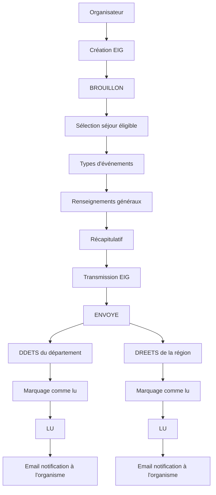
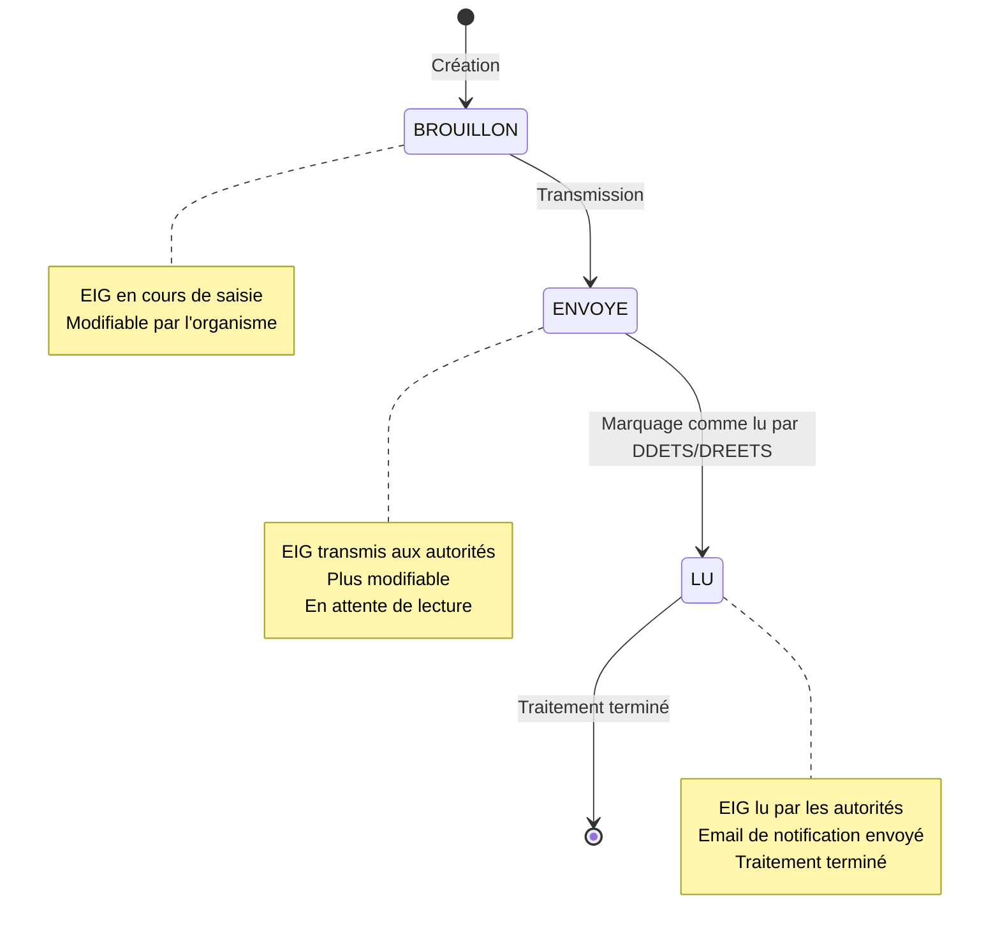

---
layout:
  width: default
  title:
    visible: true
  description:
    visible: true
  tableOfContents:
    visible: true
  outline:
    visible: true
  pagination:
    visible: false
---

# Création d'un EIG

La **création d'un EIG** se fait en plusieurs étapes via un formulaire guidé. Le processus permet de déclarer un événement indésirable grave survenu lors d'un séjour de vacances adaptées organisées.

Le parcours de création d'un EIG se fait par un formulaire en plusieurs étapes :&#x20;

* [Étape 1 - Sélection du séjour](etape-1-selection-du-sejour.md)
* [Étape 2 - Type d'événement](etape-2-type-devenement.md)
* [Étape 3 - Renseignement généraux](etape-3-renseignements-generaux.md)
* [Étape 4 - Récapitulatif](etape-4-recapitulatif.md)

***

## Workflow&#x20;

## Statuts&#x20;

