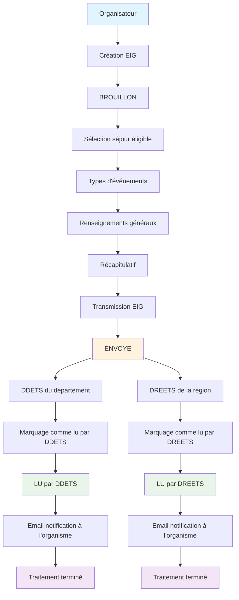
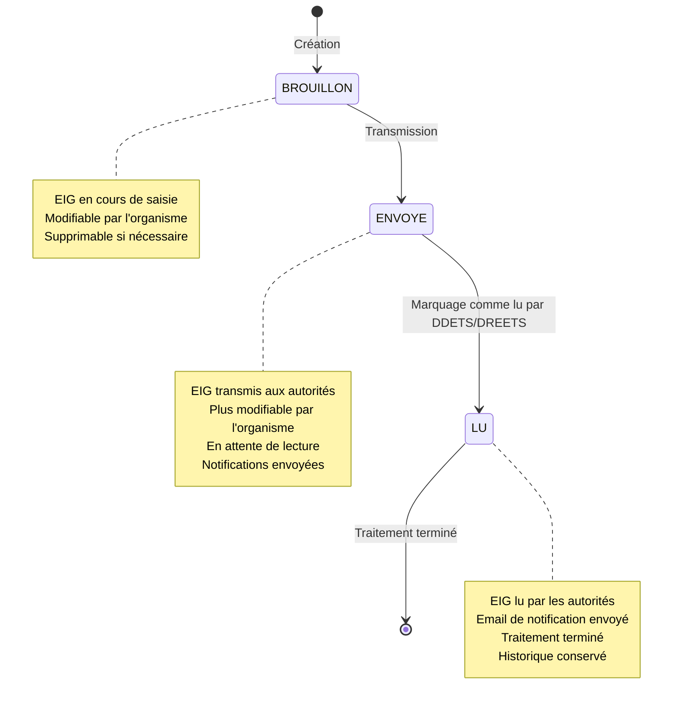

# Workflow et statuts des EIG

## Vue d'ensemble

Le **workflow des EIG** définit le parcours complet d'un événement indésirable grave, de sa création par l'organisme jusqu'à son traitement par les autorités compétentes. Les statuts permettent de suivre l'évolution de chaque EIG.

### 🎯 Objectifs

- **Traçabilité** complète des EIG
- **Notification** automatique des autorités
- **Suivi** du traitement par les agents
- **Historique** des actions effectuées

## 🔄 Workflow complet

### Workflow détaillé

### Étapes détaillées

#### **1. Création (Organisateur)**
- **Action** : Création d'un nouvel EIG
- **Acteur** : Organisme avec droits `EIG_ECRITURE`
- **Statut** : `BROUILLON`
- **Modifications** : Possibles

#### **2. Saisie des informations**
- **Sélection** du séjour éligible
- **Définition** des types d'événements
- **Renseignements** généraux
- **Document** joint (optionnel)

#### **3. Transmission**
- **Action** : Dépôt de l'EIG
- **Statut** : `ENVOYE`
- **Notifications** : Envoi automatique aux autorités
- **Modifications** : Plus possibles

#### **4. Traitement par les autorités**
- **DDETS** : Lecture et traitement
- **DREETS** : Lecture et traitement
- **Marquage** comme lu par chaque autorité
- **Notifications** : Email à l'organisme

## 📊 Statuts des EIG

### Diagramme des statuts

### Description des statuts

#### **BROUILLON**

**Caractéristiques :**
- **État** : EIG en cours de saisie
- **Modifications** : Possibles par l'organisme
- **Suppression** : Autorisée
- **Transmission** : Non effectuée

**Actions disponibles :**
- ✅ **Modification** des types d'événements
- ✅ **Édition** des renseignements généraux
- ✅ **Ajout/modification** du document joint
- ✅ **Transmission** de l'EIG
- ✅ **Suppression** de l'EIG

**Restrictions :**
- **Éligibilité** du séjour vérifiée
- **Validation** complète requise pour transmission

#### **ENVOYE**

**Caractéristiques :**
- **État** : EIG transmis aux autorités
- **Modifications** : Plus possibles par l'organisme
- **Notifications** : Envoyées aux DDETS et DREETS
- **Traitement** : En attente de lecture

**Actions disponibles :**
- ❌ **Modification** (plus possible)
- ❌ **Suppression** (plus possible)
- ✅ **Consultation** uniquement
- ✅ **Téléchargement** du document joint

**Notifications envoyées :**
- **DDETS** du département de survenue
- **DREETS** de la région d'agrément
- **Organisme** déclarant (accusé de réception)

#### **LU**

**Caractéristiques :**
- **État** : EIG lu par les autorités compétentes
- **Traitement** : Terminé
- **Historique** : Conservé
- **Notifications** : Email envoyé à l'organisme

**Actions disponibles :**
- ❌ **Modification** (plus possible)
- ❌ **Suppression** (plus possible)
- ✅ **Consultation** uniquement
- ✅ **Téléchargement** du document joint

**Notifications reçues :**
- **Email** de confirmation de lecture
- **Informations** sur l'autorité ayant lu l'EIG
- **Lien** vers la plateforme VAO

## 🔔 Notifications et emails

### Notifications de transmission

**Lors du dépôt d'un EIG :**

#### **Email DDETS**
- **Destinataire** : Services DDETS du département
- **Objet** : "VAO : Déclaration d'un évènement indésirable grave par [Organisme]"
- **Contenu** :
  - Informations sur l'organisme
  - Détails du séjour concerné
  - Types d'événements déclarés
  - Lien vers la plateforme VAO

#### **Email DREETS**
- **Destinataire** : Services DREETS de la région
- **Objet** : "VAO : Déclaration d'un évènement indésirable grave par [Organisme]"
- **Contenu** :
  - Informations sur l'organisme
  - Détails du séjour concerné
  - Types d'événements déclarés
  - Lien vers la plateforme VAO

### Notifications de lecture

**Lors du marquage comme lu :**

#### **Email à l'organisme**
- **Destinataire** : Organisme déclarant
- **Objet** : "Consultation de votre EIG déposé sur la plateforme VAO"
- **Contenu** :
  - Date de dépôt de l'EIG
  - Date de survenue de l'incident
  - Autorité ayant lu l'EIG (DDETS ou DREETS)
  - Lien vers la plateforme VAO

## 👥 Rôles et responsabilités

### Organisme déclarant

**Responsabilités :**
- **Déclaration** rapide des EIG
- **Saisie** complète des informations
- **Transmission** aux autorités
- **Suivi** des notifications

**Droits :**
- `EIG_ECRITURE` : Création et modification
- `EIG_LECTURE` : Consultation uniquement

### DDETS (Direction Départementale)

**Responsabilités :**
- **Lecture** des EIG survenus dans le département
- **Traitement** des incidents
- **Marquage** comme lu
- **Actions** correctives si nécessaire

**Territoire :**
- **Département** de survenue de l'incident
- **Compétence** géographique

### DREETS (Direction Régionale)

**Responsabilités :**
- **Lecture** des EIG des organismes agréés
- **Traitement** des incidents
- **Marquage** comme lu
- **Suivi** des organismes

**Territoire :**
- **Région** ayant délivré l'agrément
- **Compétence** par organisme

## 📈 Statistiques de traitement

### Temps de traitement

**Moyennes observées :**
- **Création → Transmission** : 2-3 heures
- **Transmission → Lecture DDETS** : 24-48 heures
- **Transmission → Lecture DREETS** : 24-72 heures
- **Lecture → Notification** : Immédiat

### Répartition par statut

**Données anonymisées :**
- **BROUILLON** : ~15% des EIG
- **ENVOYE** : ~25% des EIG
- **LU** : ~60% des EIG

## ⚠️ Cas particuliers

### EIG non éligibles

**Séjours non éligibles :**
- **Terminés** depuis plus d'une semaine
- **Statuts** non autorisés
- **Période** hors délai

**Actions :**
- **Message** d'erreur explicite
- **Redirection** vers la liste
- **Explication** des critères d'éligibilité

### Erreurs de transmission

**Causes possibles :**
- **Problème réseau** lors de la transmission
- **Serveur** indisponible
- **Données** invalides

**Actions :**
- **Message** d'erreur explicite
- **Possibilité** de réessayer
- **Sauvegarde** des données saisies

### Notifications échouées

**Causes possibles :**
- **Email** invalide ou inexistant
- **Serveur** de messagerie indisponible
- **Filtres** anti-spam

**Actions :**
- **Tentatives** de renvoi automatiques
- **Logs** des échecs
- **Support** technique si nécessaire

## 🔐 Sécurité et traçabilité

### Chiffrement des données

**Données sensibles :**
- **Déroulement** des faits (chiffré)
- **Dispositions** prises (chiffrées)
- **Précisions** des types (chiffrées)
- **Personnel** impliqué (chiffré)

### Historique des actions

**Traçabilité complète :**
- **Création** de l'EIG
- **Modifications** apportées
- **Transmission** aux autorités
- **Lectures** par les agents
- **Notifications** envoyées

### Droits d'accès

**Contrôle strict :**
- **Organisme** : Seuls ses propres EIG
- **DDETS** : EIG du département
- **DREETS** : EIG des organismes agréés
- **Audit** des accès

## 📱 Interface utilisateur

### Indicateurs visuels

**Badges de statut :**
- **BROUILLON** : Badge orange
- **ENVOYE** : Badge bleu
- **LU** : Badge vert

**Indicateurs de lecture :**
- **DDETS** : Indicateur spécifique
- **DREETS** : Indicateur spécifique
- **Dates** de lecture affichées

### Navigation contextuelle

**Actions selon le statut :**
- **BROUILLON** : Boutons de modification
- **ENVOYE** : Boutons de consultation uniquement
- **LU** : Boutons de consultation uniquement 