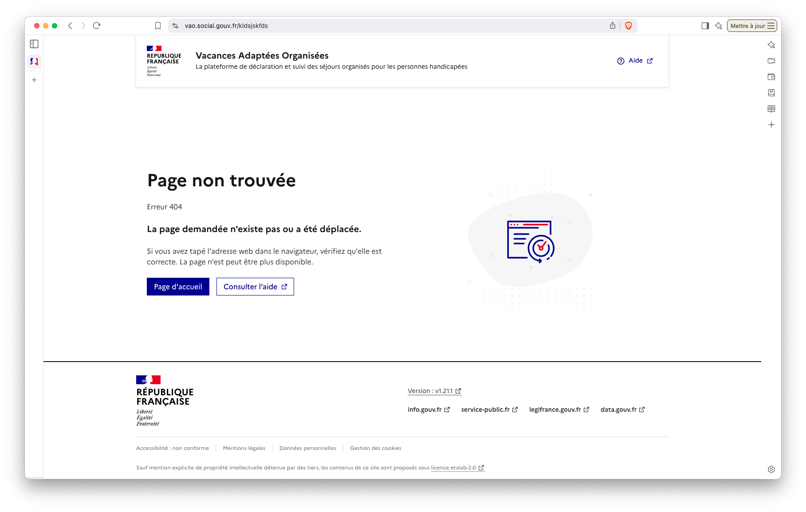

# Pages d'erreurs

<figure><figcaption></figcaption></figure>

### Fonctionnalités

- **Gestion centralisée** : Toutes les erreurs côté client sont maintenant gérées de manière uniforme
- **Expérience utilisateur améliorée** : Messages d'erreur plus clairs et informatifs
- **Navigation simplifiée** : Boutons de retour et de redirection vers les pages principales
- **Compatibilité DSFR** : Respect des standards de design du gouvernement

### Cas d'utilisation

La page d'erreur personnalisée s'affiche dans les situations suivantes :
- Erreurs de navigation (pages inexistantes)
- Erreurs de chargement de contenu
- Problèmes de connexion réseau
- Erreurs d'authentification côté client

### Message d'avertissement API externe

En cas d'indisponibilité d'une API externe, un message d'avertissement spécifique est affiché à l'utilisateur pour l'informer de la situation et des actions possibles.
