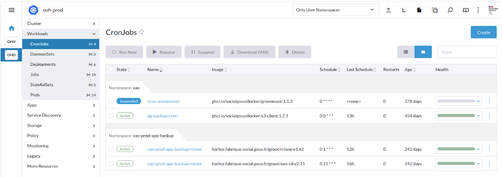
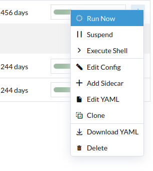
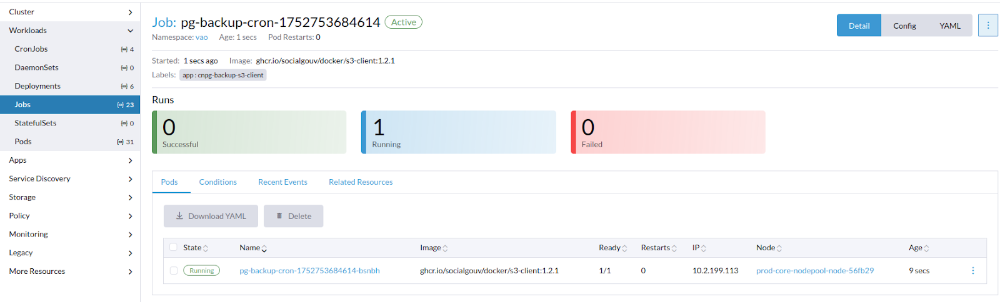
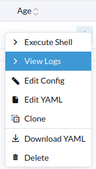
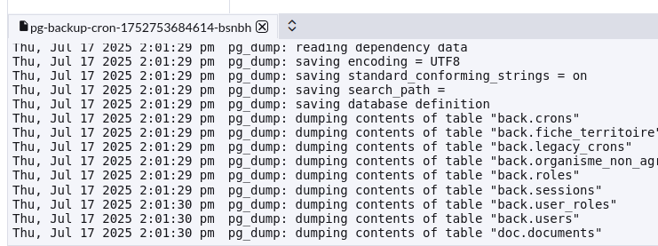
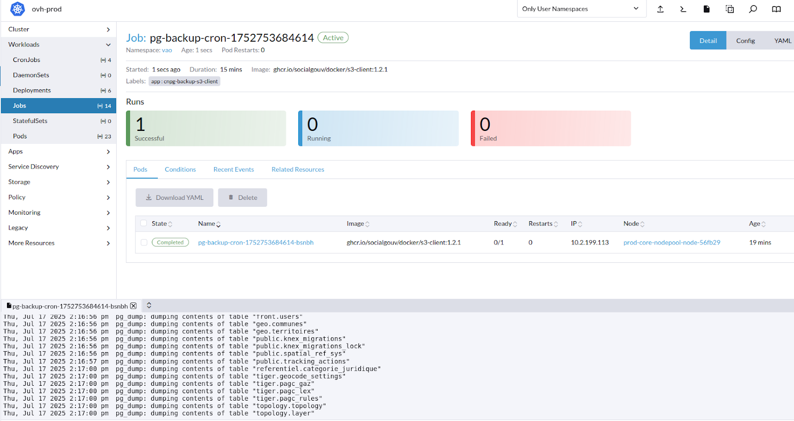

# sauvegarde BDD

## Créer une sauvegarde de la base de données avant de déployer une nouvelle version

### Prérequis

Vous devez avoir accès au rancher du projet [Rancher](https://rancher.fabrique.social.gouv.fr/)

### Créer une sauvegarde:

Aller dans OHD (Prod)
Menu Workloads
Menu CronJobs

Cliquer sur les <code>...</code> à droite du cronjob <code>pg-backup-cron</code>

Cliquer sur <code>Run Now</code>

On est alors redirigé vers la page de l'exécution du cronjob (Jobs)

On peut voir l'état du job, s'il est en cours ou terminé.
Il est possible de consulter les logs du job en cliquant sur <code>...</code> du job.

