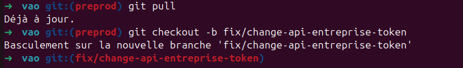

# Déploiement d’une version ou hotfix

## Prérequis :

Le déploiement en preprod et prod se font manuellement via les github Actions :

On s’assure avant tout qu’il ne subsiste pas de résidus sur la branche preprod qui ne devraient pas exister.

Pour cela faire un PR de <code>preprod -> main</code> et vérifier que le comparing ne renvoie aucun résultat.

Le comparing changes ne doit renvoyer aucun résultat.
Si ce n’est pas le cas alors se rapprocher de la dernière personne qui a laissé des résidus non mergés sur Main. 

## Option A : Déploiement d'une Release

### Phase 1 : Preprod

Faire une PR de main -> preprod 

Nommer la PR avec le numéro de version (prendre la dernière et faire +1 sur le 2eme digit)

Merger la branche sur preprod

Si le déploiement se fait correctement, l'action PreProd visible dans .

En cas de succès, la nouvelle Release sera visible sur le [github actions](https://github.com/SocialGouv/vao/actions).

## Option B : Cas du déploiement d’un hotfix

### B.1 : Fixer l'anomalie

#### Sur l’environnement de dev

Se positionner sur la branche preprod et la tirer.

Créer sa branche à partir de preprod

Ajouter, commiter et pousser son hotfix dans la branche fix/…

#### B.2 : Merger le hotfix sur github

Créer sa PR depuis sa <code>branche -> preprod</code>

  
  La PR doit se faire de la branch <code>fix/ -> preprod</code>

Merger la branche sur preprod

En cas de succès, le fix sera visible sur le [github actions](https://github.com/SocialGouv/vao/actions).

Une fois l’anomalie fixée et testé (après merge) déployer

## Environnement de Pré-production

La préprod est accessible via les URLS suivantes :

- [Backoffice Agent](https://bo-vao-preprod.ovh.fabrique.social.gouv.fr/)
- [Front usagers OVA](https://vao-preprod.ovh.fabrique.social.gouv.fr/)
- [Service de mails](https://maildev-vao-preprod.ovh.fabrique.social.gouv.fr/)
- [Service backend](https://api-vao-preprod.ovh.fabrique.social.gouv.fr/)

## Déploiement Production (Option B (hotfix) ou option A (déploiement d'une release))

### Etape 1 : Création, d'un tag

Dans le menu action et menu release : [github actions/release](https://github.com/SocialGouv/vao/actions/workflows/release.yml)

Cliquer sur “Run workflow”

  
  La workflow doit se faire de la preprod

Le résultat du déploiement sera visible dans le bloc Release de l’action.[github actions/release](https://github.com/SocialGouv/vao/actions/workflows/release.yml)

### Etape 2 : Déploiement en production

Dans le sommaire de l'action, cliquer sur le bouton "Run workflow" du bloc [Production](https://github.com/SocialGouv/vao/actions/workflows/production.yaml).

Cliquer sur Run Workflow, et se positionner sur l’onglet Tag

Sélectionner le Tag correspondant à la version (normalement le premier proposé)

Suivez votre mise en production dans le bloc [Production](https://github.com/SocialGouv/vao/actions/workflows/production.yaml).

### Etape 3 : Rapatrier les données de préprod

Cette action est à réaliser que l’on ai passé un hotfix ou une version complète en Production

## Autre déploiement

Pour déployer un autre environnement, comme une branche par exemple, il suffit de pousser la branche sur le repo, qui déploiera automatique toute la stack via l'action review-auto ou review.
Pour connaître les Urls utilisées, consulter le dernier bloc dans le Summary.
Un environnement est persisté une semaine par défaut et sera supprimé en même temps que la branche associées, sauf si celle-ci est préfixée par persist/.
