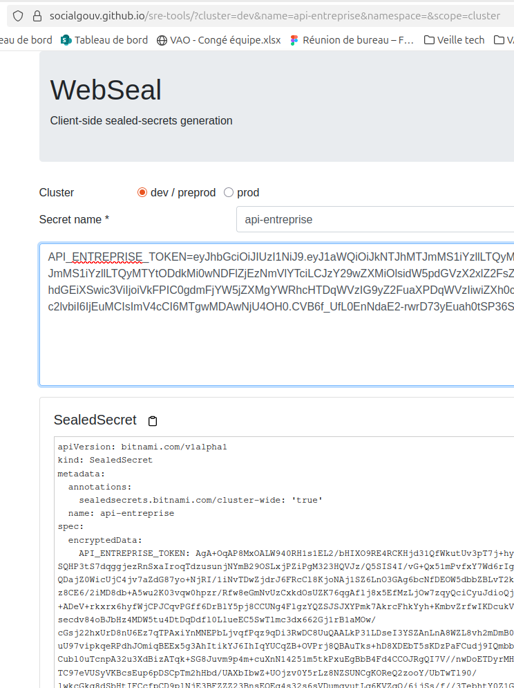
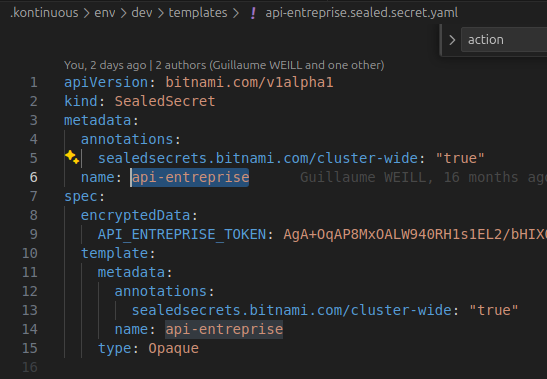
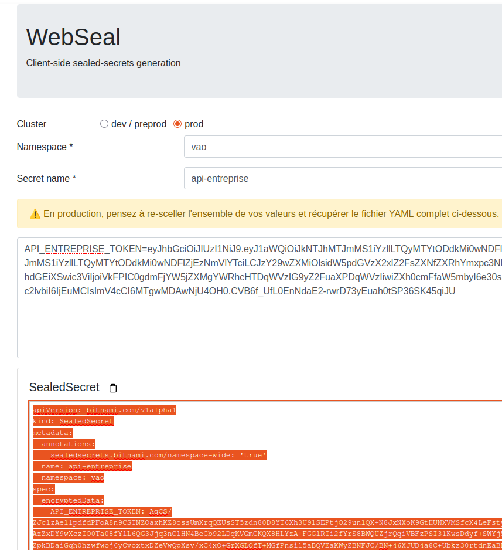

# Sceller un secret avec WebSeal

<B>Introduction :</B> Pourquoi sceller un secret ?
Sceller un secret permet de sécuriser les informations sensibles dans un fichier YAML, facilitant ainsi leur utilisation dans des environnements Kubernetes. Cela permet de gérer les secrets de manière sécurisée et centralisée, tout en évitant de les exposer dans le code source.
WebSeal est un outil qui permet de sceller ces secrets de manière sécurisée.

## Sceller un secret dans un fichier YAML pour l'utiliser dans Kubernetes.

### Sceller un secret de dev/preprod

Sur le webSeal SocialGouv [WebSeal](https://socialgouv.github.io/sre-tools/)

Choisir l'environnement <code>dev / preprod</code>

Le secret name correspond à l'ID du secret que vous souhaitez sceller.
S'il n'existe pas, il sera a créé.

S'il existe, on peut le récupérer dans le yaml.

Copier et coller le résultat dans le yaml de la template de kontinious ; dev/preprod

### Sceller un secret de Prod

Pour la Prod : indiquer le nom du workspace en plus

Copier et coller le résultat dans le yaml de la template de kontinious ; prod
Le namespace est celui que tu trouveras dans le fichier <code>.yaml</code>
Pour notre projet il s'agit de <code>namespace: vao</code>.
